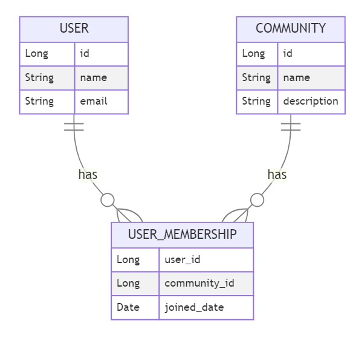

# 유저 멤버쉽 관계도

## 다대다 관계를 분리

## 개요

유저는 여러 커뮤니티에 가입 가능합니다.

커뮤니티는 여러 유저를 가질 수 있습니다.

유저의 커뮤니티 가입 관계도를 표현하려 합니다.

## 문제점

이때 유저와 커뮤니티는 서로 다대다 관계를 갖습니다.

ManyToMany로 중간 테이블을 자동으로 생성하면 편해지지만, 중간 테이블에 가입 날짜나 차단 여부같은 추가 정보를 기입하는 것은 불가능해집니다.

그러므로, 중간 테이블을 우리가 직접 만들어 추가 정보를 기입하도록 합니다.

## 해결

유저와 커뮤니티의 가입 관계를 중간 테이블로서 USER_MEMBERSHIP 테이블을 새로 생성합니다.

가입 관계를 표현하는 중간 테이블을 만듦으로서 추가 정보를 해당 테이블에 기입 가능해집니다.
