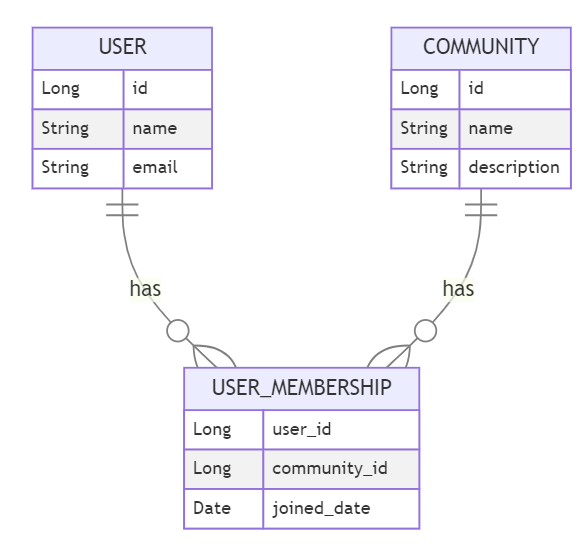
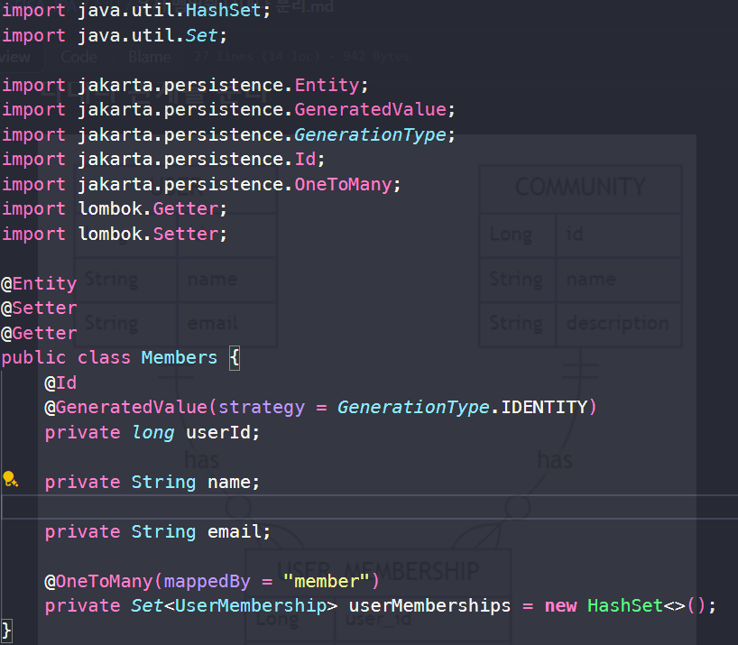
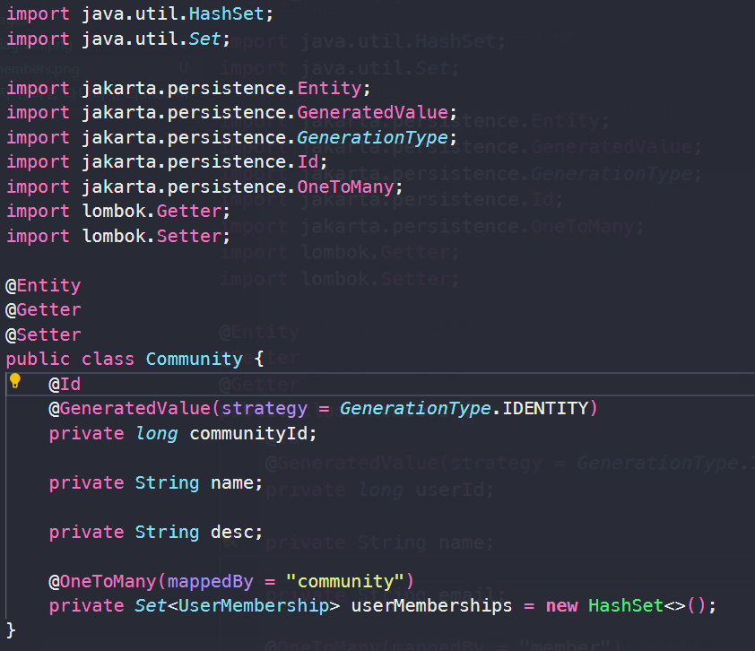
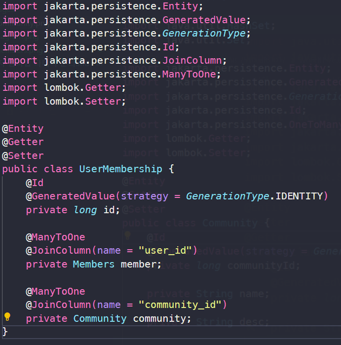
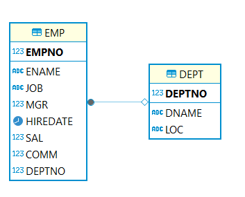
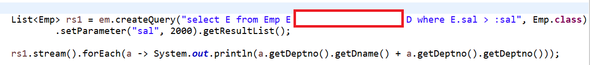

# WooriFISA JPA OJT🎏

만약에 회사에 신입사원이 들어온다면 JPA를 이해시키기 위해서 어떤 문제를 낼 것인가 고민해보며 만든 문제들입니다😀

## Team🏃‍♂️
|||||
|:-:|:-:|:-:|:-:|
|[@ChoiYoungHa](https://github.com/ChoiYoungHa)|[@jjeong1015](https://github.com/jjeong1015)|[@recoild](https://github.com/recoild)|[@0lYUMA](https://github.com/0lYUMA)|
## 실습환경🎃
<b>🍕JDK17 🥩STS 4 🎫Oracle 11 XE</b>

## ER 다이어그램


### USER 테이블
- 유저는 여러 커뮤니티에 가입 가능합니다.

### COMMUNITY 테이블
- 커뮤니티는 여러명의 유저가 이용할 수 있습니다.

### USER_MEBERSHIP 테이블
- 유저와 커뮤니티의 N:M 관계를 풀기 위한 테이블입니다.


##  OJT 문제 출제🧶
### 1. [ USER_MEBERSHIP ] 빈 칸을 채워 각 Entity간의 관계(Join)를 설정하시오. (상단 Table과 ERD를 참고하시오.)

<b>User</b>



<b>Community</b>



<b>User_membership</b>



#### 🧧정답 : <a href="AJH/유저 멤버쉽 다대다 분리.md">Link</a>
---
### 2. N+1 문제를 해결하기 위한 Fetch join 쿼리문의 빈칸을 채우시오.
### ER 다이어그램


### 문제코드🧵
```java
List<Emp> rs1 = em.createQuery(
    "select E from Emp E where sal > :sal", Emp.class)
    .setParameter("sal", 2000).getResultList();
    rs1.stream().forEach(a -> System.out.println(a.getDeptno().getDname()));
```

```sql 
select dept0_.DEPTNO as DEPTNO1_0_0_, dept0_.DNAME as DNAME2_0_0_,
dept0_.LOC as LOC3_0_0_ from Dept dept0_ where dept0_.DEPTNO=?

select dept0_.DEPTNO as DEPTNO1_0_0_, dept0_.DNAME as DNAME2_0_0_,
dept0_.LOC as LOC3_0_0_ from Dept dept0_ where dept0_.DEPTNO=?

select dept0_.DEPTNO as DEPTNO1_0_0_, dept0_.DNAME as DNAME2_0_0_,
dept0_.LOC as LOC3_0_0_ from Dept dept0_ where dept0_.DEPTNO=?
```
- 조인을 통해 가져온 Emp 객체를 통해 부서의 이름을 조회하려고 했을 때 N+1 문제가 발생한다.

### 해결코드🎨

```sql
select emp0_.EMPNO as EMPNO1_1_, emp0_.COMM as COMM2_1_,
 emp0_.deptno as deptno8_1_, emp0_.ENAME as ENAME3_1_,
 emp0_.HIREDATE as HIREDATE4_1_, emp0_.JOB as JOB5_1_,
 emp0_.MGR as MGR6_1_, emp0_.SAL as SAL7_1_ from Emp emp0_ where emp0_.SAL>?
```
#### 🧧정답 : <a href="CYH/객체참조 대신에 조인을 사용해야하는 이유.md">Link</a>